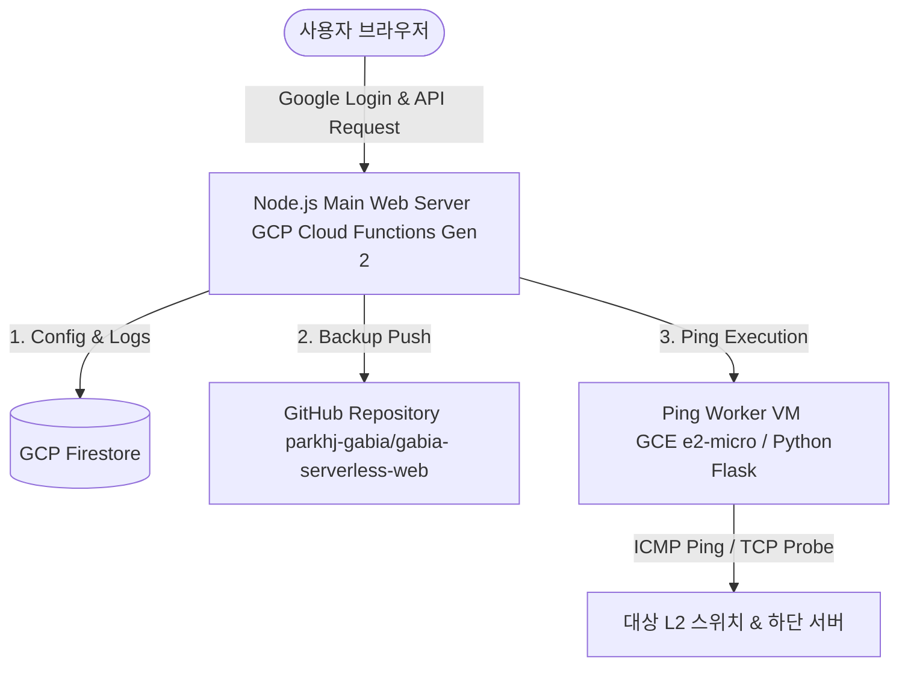

# 가비아 관제도구 플랫폼 (Gabia Serverless Web Platform)

서버리스(Google Cloud Functions Gen 2) 환경과 가상 머신(GCE e2-micro)의 장점을 결합한 하이브리드 아키텍처 기반의 **통합 관제 편의 도구 플랫폼**입니다.

---

## 🚀 주요 기능 (Applications)

본 플랫폼은 가비아 관제 및 시스템 관리를 돕는 4가지 주요 애플리케이션으로 구성되어 있습니다.

### 1. L2 하단서버 핑 점검 (🖧)
* **스마트 IP 추출**: 장애 발생 보고서나 긴 텍스트를 복사하여 붙여넣으면, 정규식을 사용하여 내부에 포함된 IP를 자동으로 추출하여 점검창에 세팅합니다.
* **하이브리드 핑 테스트**: ICMP 핑 전송이 기본이며, 방화벽 등으로 차단된 경우 TCP 포트(80, 443) 상태를 추가 검사하여 하위 서버들의 실제 가동 상태를 분석합니다.
* **핑 결과 간소화 및 복사**: 하위 서버 중 하나라도 정상이면 결과 화면에 **"하단서버 핑 정상"** 배지와 복사 📋 버튼을 노출하여, 클릭 한 번으로 신속하게 결과를 클립보드에 복사할 수 있습니다.
* **l2.list 설정 관리**: 점검의 기준이 되는 스위치 및 하위 서버 목록 구조를 웹 UI에서 직접 편집 및 실시간으로 클라우드에 반영할 수 있습니다.

### 2. 로그인 정보 생성기 (🔐)
* **패스워드 자동 생성**: 특수문자, 숫자, 대소문자 조합 등 기업의 보안 요건을 충족하는 임의의 복잡한 패스워드 및 접속 정보를 즉석에서 생성하는 빌더 모듈입니다. (`App.buildpassword/index.html` 기반)

### 3. IP (TMS/ARP) 조회 (🔍)
* **IP 주소 및 대역 정보 탐색**: 등록된 IP 목록(`ipcheck.list`) 내에서 특정 IP 혹은 와일드카드 대역(`*.` 형식)을 조회하여 해당 서브넷이나 시스템 속성 정보를 즉시 출력합니다.
* **ipcheck.list 설정 관리**: 모달창을 통해 IP 체크 정보 사전을 웹에서 실시간으로 수정 및 반영할 수 있습니다.

### 4. 야간인수인계 보고서 (📊)
* **자동 보고서 빌더**: 야간 근무 중 발생한 다양한 일일 로그 파일 내용을 정해진 규칙에 맞춰 지능적으로 파싱 및 가공하여, 인수인계용 서식으로 보고서를 자동 생성합니다. (내부 Python 스크립트 `generate_report.py` 연동)

---

## 🏗️ 아키텍처 및 시스템 구성



### 핵심 아키텍처 특성
1. **서버리스 백엔드 (Cloud Functions Gen 2)**
   * Node.js 20 런타임에서 작동하며, 유휴 상태에서는 비용이 발생하지 않는 효율적인 하이브리드 인프라를 활용합니다.
   * 서브패스 호출 시 발생할 수 있는 리소스(CSS/JS) 경로 깨짐 현상을 방지하도록 정규화 리다이렉트 미들웨어가 내장되어 있습니다.
2. **무료 티어 Worker VM (Compute Engine e2-micro)**
   * GCP Free Tier로 제공되는 e2-micro 인스턴스에 Python Flask 핑 에이전트를 상시 가동합니다.
   * `vm-startup.sh` 스크립트를 통해 부팅 시 서비스 등록(Systemd)부터 Flask 실행 환경 구축까지 자동으로 완료됩니다.
3. **Firestore 실시간 설정 동기화**
   * 점검용 데이터베이스(`l2.list`, `ipcheck.list`)를 Firestore에 저장하여 웹페이지에서 실시간으로 편집하고 영구 보관이 가능합니다.
4. **접속 기록 감사 로깅 (Audit Log)**
   * 사용자가 로그인할 때마다 접속한 **이메일, IP 주소, 브라우저 정보(User-Agent)**를 Firestore `login_logs`에 저장합니다.
   * 최신 100건의 접속 내역은 상단 톱니바퀴(설정) 버튼을 클릭하여 웹 화면에서 직접 조회할 수 있습니다 (전체 누적 최대 1,000건 유지 후 자동 순환 삭제).

---

## 🔒 보안 및 계정 관리

* **Firebase Authentication 연동**: OAuth 2.0 기반의 Google 로그인이 탑재되어 승인된 구글 계정 사용자만 API 및 리스트 편집기에 접근할 수 있습니다.
* **GitHub 자동 백업 연동**: 웹 편집기에서 `l2.list` 또는 `ipcheck.list`를 수정하여 저장하면, Firestore에 저장된 GitHub Personal Access Token(PAT)을 활용하여 원격 저장소(`BACKUP.list/`)에 즉시 자동 백업 커밋을 수행합니다. 
  * 이때 커밋 메시지에는 수정한 사람의 **Google 이메일, 접속 IP 주소, User-Agent 정보**가 포함되어 히스토리 추적이 가능합니다.

---

## 💻 로컬 개발 환경 실행 방법

개발 환경에서 테스트하기 위해서는 메인 웹 서버(Node.js)와 Ping Worker(Python)를 모두 실행해야 합니다.

### 1. 패키지 및 종속성 설치
```bash
# Node.js 패키지 설치
npm install

# Python Ping Worker 패키지 설치
cd App.L2 && pip install -r requirements.txt && cd ..
```

### 2. 로컬 실행
* **터미널 1: Python Ping Worker 실행 (5000번 포트)**
  ```bash
  python3 App.L2/worker.py
  ```
* **터미널 2: Node.js 메인 서버 실행 (8080번 포트)**
  ```bash
  npm start
  ```
* 브라우저에서 `http://localhost:8080` 으로 접속합니다. (로컬 테스트 시 Firestore 인증 환경이 구성되어 있지 않으면 설정 파일 저장 및 로그인 로그 수집 시 에러가 나거나 로컬 파일 시스템을 대체 사용합니다.)

---

## ⚙️ 초기 설정 및 배포 (Cloud Deployment)

### 1. GitHub 백업용 토큰 등록
웹 리스트 편집 시 변경본이 자동으로 깃허브에 커밋되게 하기 위해 **Fine-grained Personal Access Token (PAT)** 생성이 필요합니다.
* 자세한 방법은 [HOWTO/github_PAT생성.md](file:///Users/joonpark/Work/gabia-serverless-web/HOWTO/github_PAT생성.md)를 참고해 주세요.
* 토큰 발급 후 아래의 스크립트 도구로 Firestore에 등록합니다 (보안 상 터미널 기록에 토큰이 남지 않도록 명령어 맨 앞에 **공백 한 칸**을 띄고 실행하는 것을 권장합니다):
  ```bash
   node set-github-token.js <복사한_GITHUB_TOKEN>
  ```

### 2. 구글 클라우드 자동 배포
배포 쉘 스크립트(`deploy.sh`)가 포함되어 있어, 명령어 한 줄로 클라우드에 필요한 리소스를 자동 배포할 수 있습니다.
* **사전 요구사항**: gcloud CLI 설치 및 로그인 (`gcloud auth login`), GCP 프로젝트 연결 (`gcloud config set project [PROJECT_ID]`)
* **배포 실행**:
  ```bash
  chmod +x deploy.sh
  ./deploy.sh
  ```
  *스크립트 수행 내용:*
  1. Cloud Functions, Compute Engine, Firestore 등 필수 클라우드 API를 활성화합니다.
  2. Ping Worker 가상 머신(e2-micro)에 대한 TCP 5000번 포트 인바운드 방화벽 규칙을 적용합니다.
  3. 가상 머신 인스턴스 `ping-worker-vm`을 생성하고 `vm-startup.sh`를 활용해 자동으로 백그라운드 핑 서버를 띄웁니다.
  4. 메인 웹 앱(Cloud Functions Gen 2)을 컴파일 및 배포하며 가상 머신의 IP 주소를 환경 변수(`WORKER_API_URL`)로 주입합니다.

> [!NOTE]
> Firestore 데이터베이스 자체는 최초 1회 GCP 콘솔 내 Firestore 메뉴에 진입하여 Native 모드로 데이터베이스를 활성화해두어야 정상 연동됩니다.

### 3. 접속 주소 (URL)
구글 클라우드에 배포가 완료되면 발급된 Cloud Functions 주소로 웹 브라우저를 통해 관제도구에 접근할 수 있습니다. 
현재 설정된 프로젝트(`gabia-serverless-app`) 및 리전(`us-central1`) 기준의 기본 주소는 다음과 같습니다:

* **웹사이트 접속 주소**: [https://us-central1-gabia-serverless-app.cloudfunctions.net/gabia-serverless-web](https://us-central1-gabia-serverless-app.cloudfunctions.net/gabia-serverless-web)

*(참고: 프로젝트 ID나 배포 환경이 변경된 경우 구글 클라우드 콘솔의 Cloud Functions 메뉴에서 실제 발급된 URL을 확인하실 수 있습니다.)*
